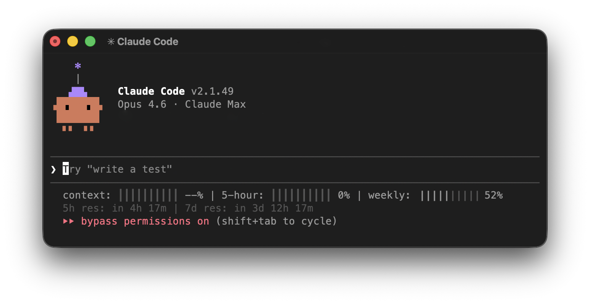

# claude-statusline-lite

Minimal status line for [Claude Code](https://docs.anthropic.com/en/docs/claude-code) showing real rate limits. Single Python file, zero dependencies.



`┃` bright = used, `│` dim = remaining. Reset times show relative countdown.

## How it works

Fetches real usage data from `api.anthropic.com/api/oauth/usage` using your Claude Code OAuth token (macOS Keychain or `~/.claude/.credentials.json`). Caches for 60s.

## Install

```bash
git clone https://github.com/simplpear/claude-statusline-lite.git
cd claude-statusline-lite
bash install.sh
```

Then restart Claude Code.

## Requirements

- Python 3.7+
- Claude Code with Pro, Max, or Team subscription

If rate limits show `--`, re-login to get the required `user:profile` OAuth scope:

```bash
claude auth logout
claude auth login
```
